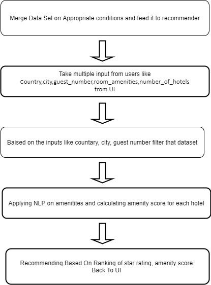
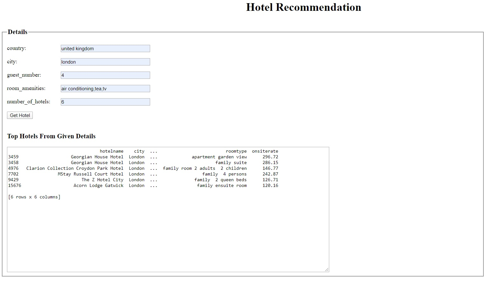

#                                                 Hotel Recommendation System 

### AMI:-
* To build a simple recommender.
* To understand the working of Flask as a web frame work for python.
* To understand deployment of an application on AWS.

### Problem Statement:-
To recommend hotel based in europe by taking into consideration user preferences.

### Reason For Doing This Project:-
* As a Data Scientist its very important to understand the production difficulties so that those are taken care off at the early stages of the project only. 
* Just building models which delivers better results without taking into consideration production difficulties will result in project failure and will cause uncertain delays which will cost a fortune.
* So to get a zest of all of this this project is done.

### Basic Work Flow Diagram Of Project:-

### Sample Output:- 

### Skills Used:- 
* Python
* Flask 
* NLP
* AWS
